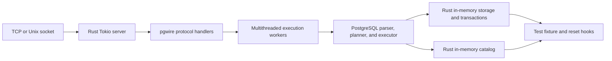

# fastpg

fastpg is an experimental Postgres-compatible database server for application
unit tests.

The goal is to keep the parts of Postgres that tests actually depend on: the
wire protocol, SQL syntax, query semantics, catalog shape, transaction behavior,
and ordinary client-driver compatibility. The pieces that make Postgres durable
and production-safe are intentionally out of scope for this server.

This is not a production database. Use upstream PostgreSQL for durable data,
security boundaries, replication, backups, crash recovery, or long-lived
workloads.

## Why This Exists

Application tests often need real Postgres behavior, but they usually do not
need a real Postgres storage system. They create schemas, load fixtures, run a
test, and throw the database state away.

fastpg explores a sharper contract:

```text
Postgres semantics,
test-optimized in-memory runtime.
```

That means tests should be able to point normal Postgres clients, ORMs, and
migration tools at fastpg, while fastpg avoids paying for WAL, shared buffers,
heap files, vacuum, background workers, physical pg_catalog tables, and
multi-process backend coordination.

## Current Shape

The Rust server is the direction of the project. It is a single-process Tokio
server that speaks the Postgres wire protocol through `pgwire`.

The SQL path reuses PostgreSQL C code where that buys compatibility:

- parser
- analyzer
- rewriter
- planner and optimizer
- expression evaluation and executor infrastructure

Long-lived database state belongs to Rust:

- in-memory catalog
- in-memory storage
- per-client session state
- transaction and rollback state
- test fixtures and reset machinery as they are added

The boundary is not "Rust versus C". The boundary is "reuse Postgres semantics,
replace Postgres physical storage".

## Architecture

Normal PostgreSQL is a production database server. It accepts client
connections through the Postgres wire protocol, runs each client session in a
backend process, and stores durable catalog and table state through the normal
filesystem-backed storage stack.


fastpg keeps the client-facing Postgres shape, but swaps the production storage
system for a disposable Rust runtime. A single Rust process accepts pgwire
connections, schedules work on Tokio, reuses PostgreSQL executor machinery for
SQL semantics, and answers catalog and table access through in-memory Rust
state instead of filesystem-backed `pg_catalog`, heap, index, and WAL files.



## Feature Matrix

Status legend: `[x]` implemented, `[ ]` planned, `Not supported` intentionally
outside the fastpg test-server scope.

| Feature | fastpg | Notes |
| --- | --- | --- |
| TCP Postgres wire protocol | [x] | Through `pgwire` |
| Unix socket wire protocol | [x] | Available on Unix platforms |
| Simple query protocol | [x] | Used by `psql` and pgbench smoke paths |
| Extended query protocol and parameters | [x] | Supported for common driver query paths |
| Authentication, SSL, GSS, and roles | Not supported | fastpg is intended to be single-user/trust-style |
| SQL parser | [x] | Reuses PostgreSQL parser |
| Analyzer, rewriter, planner, optimizer | [x] | Reuses PostgreSQL pipeline for supported statements |
| Executor and expression evaluation | [x] | Reuses PostgreSQL executor infrastructure where it can run on fastpg storage |
| DDL | [ ] | Basic table create/drop/truncate and primary-key creation are supported; selected regression-setup utilities such as `SET`, `GRANT`, tablespaces, and `COMMENT ON` are accepted as compatibility no-ops |
| `VACUUM` and `ANALYZE` | [x] | Accepted as no-op or lightweight test-compatibility hooks |
| `INSERT`, `SELECT`, `UPDATE`, `DELETE` | [x] | Current in-memory table and planner-node coverage |
| `COPY FROM STDIN` | [x] | Relation text input; file/program/query variants are not supported today |
| Transactions | [x] | In-memory commit, rollback, and subtransaction overlays |
| Concurrent clients | [x] | Multiple Tokio clients; one PostgreSQL-core execution lane for now |
| Catalog and schema introspection | [x] | Partial in-memory `pg_catalog` support for current analyzer/planner/client needs |
| Types, operators, functions, casts | [x] | Partial built-in support; more are added as tests and pgbench paths need them |
| Primary keys | [x] | Catalog visibility, uniqueness, and primary-key lookup support |
| Secondary index DDL | [x] | `CREATE INDEX` accepts built-in access methods (`btree`, `hash`, `gist`, `spgist`, `gin`, `brin`) and unique indexes so schema setup succeeds; indexes are not used for accelerated execution |
| Joins and aggregation | [x] | Partial support; simple joins and `GROUP BY` are covered |
| WAL, durability, crash recovery | Not supported | Replaced by disposable in-memory state |
| Shared buffers, heap files, pagers | Not supported | Replaced by Rust in-memory storage |
| Vacuum/autovacuum maintenance | Not supported | Production maintenance is out of scope |
| Replication, logical decoding, PITR, backups | Not supported | Durable production workflows are out of scope |
| Extensions and custom access methods | Not supported | Out of scope today |
| ACLs and security boundary fidelity | Not supported | Intended to be disabled for fast single-user tests |

## What This Is For

- Fast local and CI unit-test databases.
- Tests that need ordinary Postgres clients and SQL behavior.
- Test workloads that create schema, load fixtures, run transactions, and reset
  state quickly.
- Compatibility work where unsupported Postgres features either fail clearly or
  are deliberately accepted as no-op shims so upstream regression SQL can be
  reused.

## What This Is Not For

- Production use.
- Durable data.
- Crash recovery or WAL replay.
- Streaming replication, logical decoding, PITR, base backups, or `pg_upgrade`.
- Security, ACL, event-trigger, and extension behavior as a production
  compatibility target.
- Exact physical storage behavior such as heap pages, btree pages, HOT updates,
  TOAST tables, or vacuum.

## Repository Layout

- `crates/fastpg-server`: Tokio server entrypoint.
- `crates/fastpg-wire`: Postgres wire protocol handlers.
- `crates/fastpg-session`: per-client session state.
- `crates/fastpg-pgcore`: Rust facade over the reused PostgreSQL C pipeline.
- `crates/fastpg-catalog`: in-memory catalog source of truth.
- `crates/fastpg-storage`: in-memory table storage and transaction overlays.
- `crates/fastpg-exec`: query execution facade used by the wire layer.
- `benches/`: pgbench, regression, validation, and profiling harnesses.
- `spec/`: design notes and implementation specs.

## Build And Test

Run the Rust unit tests:

```sh
cargo test --workspace
```

Run the current validation bundle:

```sh
make -C benches validate
```

Run the TPC-B-like pgbench comparison against the Rust server:

```sh
make -C benches pgbench-tpcb
```

Run simple-update with pgbench primary-key indexes:

```sh
make -C benches pgbench-simple-indexed
```

Run the upstream PostgreSQL SQL regression inventory:

```sh
make -C benches regression
```

Most full-execution tests build a local fastpg-enabled PostgreSQL core and pass
that build directory to Cargo through `FASTPG_POSTGRES_BUILD_DIR`. The harnesses
under `benches/` do that setup for you. The default fastpg build includes the
internal IPC guard and builds pgvector into the generated PostgreSQL install.
Set `PGVECTOR=0` for harness runs that must skip the extension download/build.

## Run The Server

Manual full-execution runs need a local fastpg-enabled PostgreSQL core build.
The harnesses create one under `benches/.build/pgbench/fastpg`. After running a
Rust-server harness once, start the server with:

```sh
FASTPG_POSTGRES_BUILD_DIR=benches/.build/pgbench/fastpg \
  cargo run -p fastpg-server --features postgres-execution
```

The server listens on `127.0.0.1:55432` by default. To choose an address:

```sh
FASTPG_POSTGRES_BUILD_DIR=benches/.build/pgbench/fastpg \
  cargo run -p fastpg-server --features postgres-execution -- 127.0.0.1:65432
```

Then connect with ordinary Postgres clients:

```sh
psql -h 127.0.0.1 -p 55432 -U postgres -d postgres
```

When using PostgreSQL's installed `psql` from this repository, the harnesses set
client environment variables that keep protocol negotiation on the supported
path:

```sh
export PGMAXPROTOCOLVERSION=3.0
export PGSSLMODE=disable
export PGGSSENCMODE=disable
```

## Benchmark And Profile

The pgbench harness compares normal Postgres against the Rust server and records
JSON plus Markdown summaries under `benches/results/`.

```sh
make -C benches pgbench
```

The default `pgbench` target is an unindexed simple-update smoke path
(`INIT_STEPS=dtg`). Use `pgbench-simple-indexed` or `pgbench-tpcb` for indexed
UPDATE performance comparisons. Generated summaries warn when the `p` init step
is missing.

To run the storage engine Criterion benchmarks:

```sh
make -C benches bench
```

To capture a Rust-server flamegraph:

```sh
make -C benches profile
```

To run and open the newest profile:

```sh
make -C benches profile-open
```

Benchmark numbers are local measurements, not portable guarantees. Treat them
as evidence for a given commit and machine, not as project promises.

## Release Artifacts

The GitHub release workflow builds the Rust server in release mode, compiles
pgvector against the matching PostgreSQL install, packages the server with
Postgres client tools such as `psql` and `pgbench`, smoke-tests the packaged
server, and uploads archives for Linux and macOS targets.

These artifacts are still test-server artifacts. They are not Postgres
production distributions.

## Development Notes

- Keep normal PostgreSQL builds working when fastpg support is disabled.
- Keep PostgreSQL C changes behind compile-time fastpg guards.
- Prefer clear unsupported-feature errors over silent compatibility gaps.
- Validate correctness before trusting performance numbers.
- Do not commit generated build directories or benchmark results.

Copyright and license information from PostgreSQL is in [COPYRIGHT](COPYRIGHT).
Upstream PostgreSQL documentation is at <https://www.postgresql.org/docs/devel/>.
